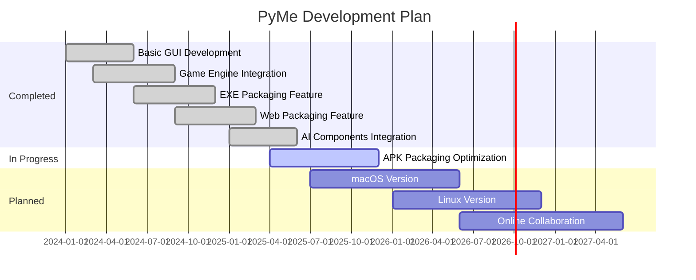

🌐 **English** | 🀄 **[简体中文](README_zh.md)**

# PyMe

### 🎯 Visual Programming Tool for Beginners

**PyMe** is a visual development tool designed specifically for programming beginners. Build desktop applications, games, and mobile apps like assembling building blocks. No need to memorize complex syntax—just drag components, set properties, write logic, and complete your first program in three steps!

[<kbd>🌐 Website</kbd>](https://www.py-me.com)
[<kbd>📖 Documentation</kbd>](https://www.py-me.com/doc)
[<kbd>📺 Video Tutorials</kbd>](https://www.youtube.com/channel/pyme)
[<kbd>💬 Community</kbd>](https://github.com/pyme/pyme/discussions)

---

## ⚠️ Important Notice

> **📦 Binary Distribution Only**
>
> This repository contains the **compiled binary distribution** of PyMe, a proprietary Windows desktop application. The source code is not publicly available and this repository does not contain the original programming code.
>
> **What you get:**
> - ✅ Ready-to-use executable files
> - ✅ Complete documentation and tutorials
> - ✅ Sample projects and examples
>
> **What you don't get:**
> - ❌ Source code (proprietary and confidential)
> - ❌ Development environment setup files
>
> For more information, please visit our [official website](https://www.py-me.com).

---

## ✨ Why Choose PyMe?

### 🎨 WYSIWYG Visual Design

Say goodbye to boring code writing! In PyMe, you can drag buttons, text boxes, images and other components directly onto the interface, designing software like drawing pictures. Real-time preview lets you see results immediately.

### 🎮 Built-in Game Development Module

Not satisfied with just regular software? PyMe has a built-in game development engine supporting 2D game creation. You can easily create:
- 🐍 Classic games like Snake and Tetris
- 🚀 Shoot 'em up games
- 🧩 Puzzle games
- And any game ideas you can imagine!

### 📱 One-Click Multi-Platform Packaging

After completing development, PyMe can package your work with one click into:
- 🖥️ **Windows Desktop Application (.exe)** - Run independently, no Python installation needed
- 🌐 **Web Application** - Deploy to server, accessible worldwide
- 📱 **Android Mobile App (.apk)** - Install on phone, use anywhere

### 🗃️ Rich Built-in Components

PyMe provides 50+ carefully designed UI components:
- 📋 Buttons, input boxes, dropdown menus, lists
- 📊 Charts, progress bars, sliders
- 📁 File operations, database connections
- 🌐 Network requests, browser control
- 🎵 Audio playback, video playback
- 🤖 AI integration (voice chat, image recognition)

### 📚 Complete Learning System

Built-in 20+ beginner tutorials, from "Hello World" to complete projects, guiding you step by step. Every tutorial includes detailed steps and sample code.

### 🔒 Safety & Stability

- Code encryption to protect your intellectual property
- Auto-backup to prevent data loss
- 6 years of continuous iteration, stability verified by thousands of users

---

## 🚀 Quick Start

### Download & Install

1. Visit [PyMe Website](https://www.py-me.com) to download the latest version
2. Extract the downloaded package to any directory
3. Double-click `PyMe.exe` to start the program

> ⚠️ **System Requirements**: Windows 10/11 (64-bit), 4GB+ RAM recommended

### Create Your First Project

1. **Launch PyMe** and see the welcome screen
2. Click the **"New Project"** button
3. Choose project type:
   - 📱 GUI Application - Create software with interface
   - 🎮 Game Application - Create 2D games
   - 🌐 Web Application - Create web apps
4. **Drag components** from the left panel to the form
5. Double-click component to enter **code editor** and write interaction logic
6. Click **"Run"** button to preview effects
7. When satisfied, click **"Package"** to generate final application

### Video Tutorials

- [PyMe Beginner Tutorial Series](https://www.youtube.com/watch?v=example1)
- [Game Development Practice Tutorial](https://www.youtube.com/watch?v=example2)
- [APP Packaging & Publishing Guide](https://www.youtube.com/watch?v=example3)

---

## 🎯 Use Cases

| Scenario | Example Projects | Difficulty |
|:---:|:---|:---:|
| 🏫 **Programming Learning** | Understanding variables, loops, functions | ⭐ |
| 📊 **Office Automation** | Batch file processing, data spreadsheet | ⭐⭐ |
| 🎮 **Small Game Development** | Snake, Tetris, Puzzle games | ⭐⭐ |
| 🖥️ **Desktop Tools** | Calculator, Notepad, Image viewer | ⭐⭐ |
| 🌐 **Small Websites** | Personal blog, Portfolio website | ⭐⭐⭐ |
| 📱 **Mobile Apps** | Todo list, Weather forecast, Notepad | ⭐⭐⭐ |

---

## 📦 Built-in Components Overview

### Basic Controls
| Component | Description | Component | Description |
|:---:|:---|:---:|:---|
| 🔘 Button | Regular button | 📝 Label | Text label |
| ⌨️ Entry | Single-line input | 📄 Text | Multi-line text box |
| 📂 ListBox | List box | 🌐 ComboBox | Dropdown menu |
| ☑️ CheckButton | Checkbox | 🔘 RadioButton | Radio button |
| 🖼️ LabelFrame | Titled frame | 📊 Canvas | Drawing canvas |

### Data Visualization
| Component | Description | Component | Description |
|:---:|:---|:---:|:---|
| 📈 Line | Line chart | 🥧 Pie | Pie chart |
| 📊 Bar | Bar chart | 📉 Histogram | Histogram |
| 〰️ Scale | Slider | ⏱️ ProgressBar | Progress bar |

### Media Components
| Component | Description | Component | Description |
|:---:|:---|:---:|:---|
| 🎵 AudioPlayer | Audio player | 🎬 VideoPlayer | Video player |
| 📷 VideoCapture | Camera capture | 🎙️ Microphone | Recording |

### System Interaction
| Component | Description | Component | Description |
|:---:|:---|:---:|:---|
| 📁 FileReader | File read/write | 🗄️ DataTable | Database table |
| 🌐 BrowserControl | Browser control | 🔌 Serial | Serial communication |
| 📡 Socket | Network programming | 🖥️ WMI | System information |

### AI Smart Components
| Component | Description | Component | Description |
|:---:|:---|:---:|:---|
| 🤖 AIChat | Smart chat | 🎙️ AIVoice | Voice synthesis |
| 👁️ AIImage | Image recognition | 🗣️ AISpeech | Speech recognition |

---

## ❓ Frequently Asked Questions (FAQ)

<b>Q: Does PyMe support macOS or Linux?</b>

**Not currently.** PyMe only provides a Windows version (Windows 10/11 supported). We are evaluating macOS and Linux compatibility requirements, and future versions may add support. If you have strong demand, feel free to share in [Issues](https://github.com/pyme/pyme/issues)!

<b>Q: Is PyMe free? Can I use it for commercial purposes?</b>

**Yes, completely free and can be used commercially.** All projects you develop with PyMe belong to you. You can freely publish, sell, or open-source them. PyMe also offers a free version for personal and commercial use.

<b>Q: Do I need to install Python to run packaged programs?</b>

**No.** PyMe-packaged .exe applications are standalone executables that include all necessary dependencies. Users don't need to install Python or any other software—just double-click to run.

<b>Q: I have no programming background. Can I learn PyMe?</b>

**Absolutely!** PyMe is designed specifically for zero-baseline users. We provide complete beginner tutorials with detailed guidance from installation to creating your first program. Most users complete their first small project within 1-2 hours.

<b>Q: How do I publish a web application after packaging?</b>

PyMe-packaged web applications are a set of HTML/CSS/JS files. You can:
1. Use free hosting services (GitHub Pages, Netlify, Vercel)
2. Deploy to your own server
3. Upload to other CDN services for faster global access

See: [Web Application Deployment Guide](https://www.py-me.com/doc/web-deploy)

<b>Q: Is Android APK packaging free?</b>

**Basic packaging is free.** PyMe can package your project into APK files. If you need advanced features like removing watermarks or publishing to app stores, consider our professional services.

<b>Q: What's the difference between PyMe and Scratch?</b>

| Feature | Scratch | PyMe |
|:---:|:---:|:---:|
| Target Users | Children's programming introduction | Teenagers and adults |
| Output Format | Mainly for educational display | Publishable products |
| Interface Style | Visual building blocks | Professional software interface |
| Packaging | Cannot package standalone apps | Package exe/web/apk |
| Learning Value | Cultivate programming thinking | Learn real programming logic |

<b>Q: Will my code be leaked? How to protect source code?</b>

PyMe provides **source code encryption** to protect your intellectual property. Encrypted code is difficult to decompile. How to enable: Check "Enable source code encryption" in project properties.

<b>Q: How do I get help or make suggestions?</b>

You can contact us through:
- 📧 Email: 285421210@qq.com
- 💬 GitHub Issues: Report bugs or request features
- 💬 GitHub Discussions: Exchange experiences with other users
- 📺 YouTube Comments: Leave messages under tutorial videos
- 📺 Twitter: @Honghaier_game
- 💬 Discord: Join PyMe official Discord server
- 🐧 QQ Group: 100180960

---

## 🗺️ Development Roadmap

---

## 🤝 Feedback & Support

We value your feedback! While we cannot accept code contributions (as this is a binary distribution), we welcome:

- 💡 Feature suggestions and requests
- 🐛 Bug reports and issue reports
- 📖 Documentation improvements
- 💬 Sharing your PyMe projects and experiences

Please use [GitHub Issues](https://github.com/pyme/pyme/issues) to report bugs or request features, and [GitHub Discussions](https://github.com/pyme/pyme/discussions) to share your projects and connect with other users.

---

## 📄 License

This project follows a proprietary license. See [LICENSE](LICENSE) file for details.

🌐 **English** | 🀄 **[中文版许可证](LICENSE_zh.md)**

---

**If this project helps you, please give it a ⭐ Star!**

Made with ❤️ by [PyMe Team](https://www.py-me.com)

