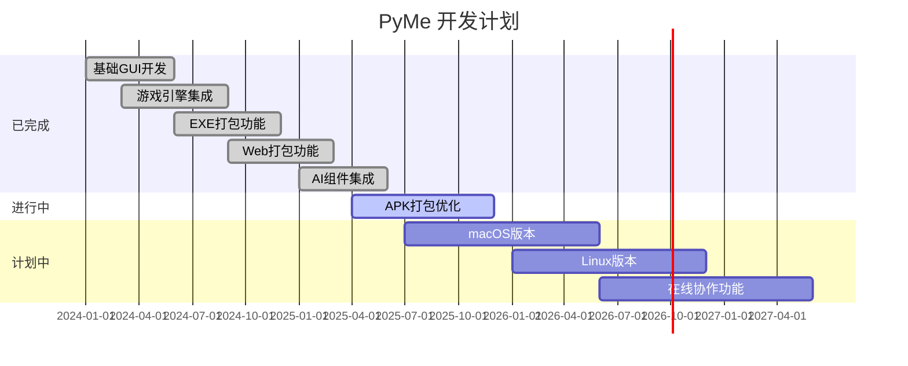

🌐 **[English](README.md)** | 🀄 **简体中文**

# PyMe

### 🎯 面向零基础的可视化编程工具

**PyMe** 是一款专为编程初学者打造的可视化开发工具，让你可以像搭积木一样创建桌面应用、游戏和手机应用。无需记忆复杂语法，只需拖拽组件、设置属性、编写逻辑，三步即可完成你的第一个程序！

[<kbd>🌐 官网首页</kbd>](https://www.py-me.com)
[<kbd>📖 使用文档</kbd>](https://www.py-me.com/doc)
[<kbd>📺 视频教程</kbd>](https://space.bilibili.com/channel/pyme)
[<kbd>💬 用户社区</kbd>](https://github.com/pyme/pyme/discussions)

---

## ⚠️ 重要声明

> **📦 仅提供编译好的可执行文件**
>
> 本仓库包含 PyMe 的**编译后二进制分发版本**，这是一款专有的 Windows 桌面应用程序。源代码不对外开放，本仓库不包含原始编程代码。
>
> **你可以获得：**
> - ✅ 开箱即用的可执行文件
> - ✅ 完整的文档和教程
> - ✅ 示例项目和案例
>
> **你无法获得：**
> - ❌ 源代码（专有且保密）
> - ❌ 开发环境配置文件
>
> 更多信息，请访问我们的[官方网站](https://www.py-me.com)。

---

## ✨ 为什么选择 PyMe？

### 🎨 所见即所得的可视化设计

告别枯燥的代码编写！在 PyMe 中，你可以直接拖拽按钮、文本框、图片等组件到界面上，像画图一样设计软件界面。实时预览功能让你立即看到效果，所见即所得。

### 🎮 内置游戏开发模块

不想只做普通软件？PyMe 内置了游戏开发引擎，支持 2D 游戏制作。你可以轻松创建：

- 🐍 贪吃蛇、俄罗斯方块等经典游戏
- 🚀 飞行射击游戏
- 🧩 益智解谜游戏
- 以及任何你能想到的游戏创意！

### 📱 一键打包多平台应用

完成开发后，PyMe 可以将你的作品一键打包成：

- 🖥️ **Windows 桌面应用 (.exe)** - 独立运行，无需安装 Python
- 🌐 **Web 网页应用** - 发布到服务器，全球可访问
- 📱 **Android 手机应用 (.apk)** - 安装到手机，随时随地使用

### 🗃️ 丰富的内置组件

PyMe 提供了 50+ 精心设计的 UI 组件：

- 📋 按钮、输入框、下拉菜单、列表
- 📊 图表、进度条、滑块
- 📁 文件操作、数据库连接
- 🌐 网络请求、浏览器控制
- 🎵 音频播放、视频播放
- 🤖 AI 集成（语音对话、图像识别）

### 📚 完整的教学体系

内置 20+ 个新手教学向导，从"Hello World"到完整项目，循序渐进带你入门。每个教程都配有详细步骤和示例代码。

### 🔒 安全与稳定

- 代码加密功能，保护你的知识产权
- 自动备份功能，防止意外丢失
- 6 年持续迭代，稳定性经过大量用户验证

***

## 🚀 快速开始

### 下载安装

1. 访问 [PyMe 官网](https://www.py-me.com) 下载最新版本
2. 解压下载的压缩包到任意目录
3. 双击 `PyMe.exe` 启动程序

> ⚠️ **系统要求**：Windows 10/11（64位），建议内存 4GB 以上

### 创建你的第一个项目

1. **启动 PyMe**，看到欢迎界面
2. 点击 **"新建项目"** 按钮
3. 选择项目类型：
   - 📱 GUI 应用 - 创建带界面的软件
   - 🎮 游戏应用 - 创建 2D 游戏
   - 🌐 Web 应用 - 创建网页应用
4. 在左侧组件栏中 **拖拽组件** 到窗体上
5. 双击组件进入 **代码编辑器**，编写交互逻辑
6. 点击 **"运行"** 按钮预览效果
7. 满意后点击 **"打包"** 生成最终应用

### 视频教程

- [PyMe 新手入门系列](https://www.bilibili.com/video/BV1xx411c7M7)
- [游戏开发实战教程](https://www.bilibili.com/video/BV1xx411c7M8)
- [APP 打包发布指南](https://www.bilibili.com/video/BV1xx411c7M9)

***

## 🎯 应用场景

| 场景 | 示例项目 | 难度 |
|:---:|:---|:---:|
| 🏫 **编程学习** | 理解变量、循环、函数等编程概念 | ⭐ |
| 📊 **办公自动化** | 文件批量处理、数据表格整理 | ⭐⭐ |
| 🎮 **小游戏开发** | 贪吃蛇、俄罗斯方块、拼图游戏 | ⭐⭐ |
| 🖥️ **桌面工具** | 计算器、记事本、图片查看器 | ⭐⭐ |
| 🌐 **小型网站** | 个人博客、作品展示网站 | ⭐⭐⭐ |
| 📱 **移动应用** | 待办事项、天气预报、记事本 | ⭐⭐⭐ |

---

## 📦 内置组件一览

### 基础控件
| 组件 | 说明 | 组件 | 说明 |
|:---:|:---|:---:|:---|
| 🔘 Button | 普通按钮 | 📝 Label | 文本标签 |
| ⌨️ Entry | 单行输入框 | 📄 Text | 多行文本框 |
| 📂 ListBox | 列表框 | 🌐 ComboBox | 下拉菜单 |
| ☑️ CheckButton | 复选框 | 🔘 RadioButton | 单选按钮 |
| 🖼️ LabelFrame | 带标题的框架 | 📊 Canvas | 画布 |

### 数据可视化
| 组件 | 说明 | 组件 | 说明 |
|:---:|:---|:---:|:---|
| 📈 Line | 折线图 | 🥧 Pie | 饼图 |
| 📊 Bar | 柱状图 | 📉 Histogram | 直方图 |
| 〰️ Scale | 滑块 | ⏱️ ProgressBar | 进度条 |

### 媒体组件

|        组件       | 说明    |       组件       | 说明    |
| :-------------: | :---- | :------------: | :---- |
|  🎵 AudioPlayer | 音频播放器 | 🎬 VideoPlayer | 视频播放器 |
| 📷 VideoCapture | 摄像头捕获 | 🎙️ Microphone | 录音功能  |

### 系统交互
| 组件 | 说明 | 组件 | 说明 |
|:---:|:---|:---:|:---|
| 📁 FileReader | 文件读写 | 🗄️ DataTable | 数据库表格 |
| 🌐 BrowserControl | 浏览器控制 | 🔌 Serial | 串口通信 |
| 📡 Socket | 网络编程 | 🖥️ WMI | 系统信息 |

### AI 智能组件

|      组件     | 说明   |      组件      | 说明   |
| :---------: | :--- | :----------: | :--- |
|  🤖 AIChat  | 智能对话 |  🎙️ AIVoice | 语音合成 |
| 👁️ AIImage | 图像识别 | 🗣️ AISpeech | 语音识别 |

***

## ❓ 常见问题 (FAQ)

<b>Q: PyMe 支持 macOS 或 Linux 系统吗？</b>

**目前暂不支持。** PyMe 目前仅提供 Windows 版本（支持 Windows 10/11）。我们正在评估 macOS 和 Linux 的兼容性需求，未来版本可能会增加支持。如果您有强烈需求，欢迎在 [Issue](https://github.com/pyme/pyme/issues) 中反馈！

<b>Q: 使用 PyMe 开发的项目是免费的吗？可以商用吗？</b>

**是的，完全免费且可以商用。** 你使用 PyMe 开发的所有项目归你所有，可以自由发布、销售或开源。PyMe 本身也提供免费版本供个人和商业使用。

<b>Q: 打包后的程序需要安装 Python 才能运行吗？</b>

**不需要。** PyMe 打包的 .exe 应用是独立的可执行文件，已经包含了运行所需的所有依赖，用户电脑上无需安装 Python 或任何其他软件，可以直接双击运行。

<b>Q: 我没有任何编程基础，能学会 PyMe 吗？</b>

**当然可以！** PyMe 正是为零基础用户设计的产品。我们提供了完整的新手教程，从安装到创建第一个程序，每一步都有详细指导。大多数用户在 1-2 小时内就能完成第一个小作品。

<b>Q: 打包 Web 应用后如何发布到网上？</b>

PyMe 打包的 Web 应用是一组 HTML/CSS/JS 文件，你可以：
1. 使用免费托管服务（如 GitHub Pages、Netlify、Vercel）
2. 部署到自己的服务器
3. 上传到 Gitee Pages（国内访问更快）

具体教程请参考：[Web 应用发布指南](https://www.py-me.com/doc/web-deploy)

<b>Q: 打包 Android APK 需要收费吗？</b>

**基础打包功能免费。** PyMe 可以将你的项目打包为 APK 文件。如果需要去除水印、发布到应用市场等高级功能，可以考虑我们的专业版服务。

<b>Q: PyMe 和 Scratch 有什么区别？</b>

| 对比项 | Scratch | PyMe |
|:---:|:---:|:---:|
| 目标用户 | 儿童编程启蒙 | 青少年及成人 |
| 输出形式 | 主要面向教育展示 | 可发布的产品 |
| 界面风格 | 可视化积木块 | 专业软件界面 |
| 打包能力 | 无法打包独立应用 | 可打包 exe/web/apk |
| 学习价值 | 培养编程思维 | 学习真实编程逻辑 |

<b>Q: 我的代码会被泄露吗？如何保护源码安全？</b>

PyMe 提供了**源码加密**功能，可以对你的项目进行加密保护。加密后的代码难以被反编译，有效保护你的知识产权。设置方法：在项目属性中勾选"启用源码加密"选项即可。

<b>Q: 如何获得帮助或提出建议？</b>

你可以通过以下方式联系我们：
- 📧 邮箱：285421210@qq.com
- 💬 GitHub Issues：报告 Bug 或提出功能建议
- 💬 GitHub Discussions：与其他用户交流经验
- 📺 B站评论区：视频教程下方留言
- 🐧 QQ群：100180960

***

## 🗺️ 开发路线图

---

## 🤝 反馈与支持

我们重视您的反馈！虽然我们无法接受代码贡献（因为这是二进制分发版本），但我们非常欢迎：

- 💡 功能建议和请求
- 🐛 Bug 报告和问题反馈
- 📖 文档改进
- 💬 分享您的 PyMe 项目和使用经验

请使用 [GitHub Issues](https://github.com/pyme/pyme/issues) 报告 Bug 或请求功能，使用 [GitHub Discussions](https://github.com/pyme/pyme/discussions) 分享您的项目并与其他用户交流。

---

## 📄 许可证

本项目遵循专有许可证。更多详情请参阅 [LICENSE](LICENSE) 文件。

🌐 **[英文版许可证](LICENSE)** | 🀄 **中文版**

---

**如果这个项目对你有帮助，欢迎 ⭐ Star 支持一下！**

Made with ❤️ by [PyMe Team](https://www.py-me.com)

